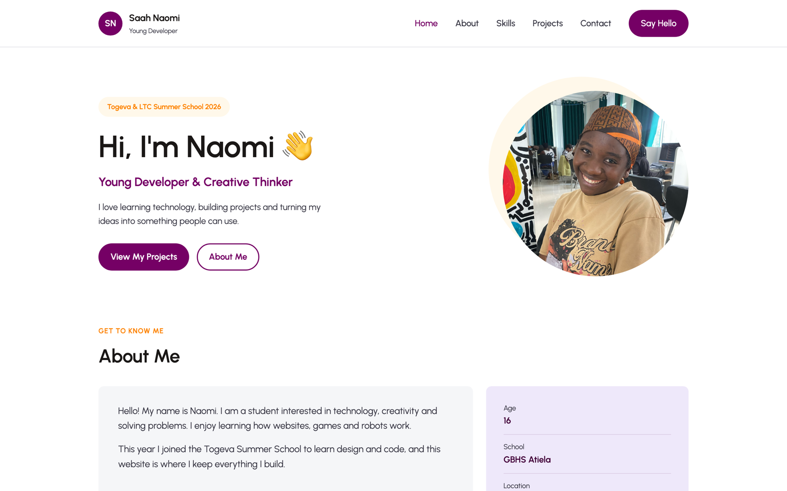

<div align="center">

<h1 align="center">Saah Naomi</h1>

<p align="center"><strong>A one-page personal portfolio, built with HTML and CSS only.</strong></p>

<p align="center">
  Who she is &nbsp;&middot;&nbsp; what she can do &nbsp;&middot;&nbsp; what she has built
  <br />
  the things she loves &nbsp;&middot;&nbsp; and how to reach her
</p>

<p align="center"><a href="https://togevacm.github.io/portfolio/"></a></p>

<p align="center">&nbsp;&nbsp;&nbsp;&nbsp;&nbsp;&nbsp;&nbsp;</p>

<br />

<p align="center"><a href="https://togevacm.github.io/portfolio/"></a></p>

<p align="center"><em><a href="https://togevacm.github.io/portfolio/">Open the live site</a> to see the whole page.</em></p>

</div>

---

## About this project

This is the third project of the Summer School and the first one that is
entirely about the student. The brief was simple: one page, eight blocks, two
files, and **one layout tool the whole way through — flexbox**.

The site introduces Naomi, lists what she can do, shows the projects she has
built so far, and gives people a way to reach her.

## The eight blocks

| # | Block | What it does |
|---|---|---|
| 1 | Header | Name on the left, menu on the right, thin grey line underneath. Sticks to the top when you scroll. |
| 2 | Hero | The big hello, a role line, two buttons, and a round photo sitting on a cream circle. |
| 3 | About | A grey text card next to a lavender card of quick facts. |
| 4 | Skills | Four equal cards — HTML, CSS, Scratch, UI/UX Design. |
| 5 | Projects | Three cards with a picture, a tag, a description and a link. |
| 6 | Things I Love | Pills that wrap onto a new line when the row is full. |
| 7 | Contact | The purple block, with three ways to get in touch. |
| 8 | Footer | The Togeva and LTC marks, and a line signing the work. |

## Colours and type

| Role | Value |
|---|---|
| Togeva purple | `#750065` |
| Togeva deep purple | `#420039` |
| Amber | `#FCA311` / `#FD8301` |
| LTC green | `#1D553A` |
| Text | `#1A1716` |
| Muted text | `#3A3946` |
| Grey card | `#F5F6F8` |
| Lavender card | `#EEE8FA` |
| Cream | `#FFF8EA` |
| Pale blue | `#E6F4F6` |
| Border | `#DFE0E6` |
| Typeface | Urbanist (400 / 500 / 600 / 700) |

Cards use `border-radius: 10px`. Anything pill-shaped uses `border-radius: 999px`.

## Files

```
portfolio/
├── index.html              the whole page
├── docs/
│   └── hero.png            the screenshot at the top of this README
├── style.css               all of the styling
├── naomi.png               hero photo
├── dino game.png           project screenshot
├── catch the apple.jpg     project screenshot
├── my first website.jpg    project screenshot
├── profile.jpg             spare photo
└── images/
    ├── togeva-logo.png
    └── ltc-logo.png
```

## Running it locally

Clone the repo and open the page — there is nothing to install and nothing to
build.

```bash
git clone https://github.com/togevacm/portfolio.git
cd portfolio
open index.html
```

If you would rather serve it over HTTP (so paths behave exactly as they do on
GitHub Pages):

```bash
python3 -m http.server 8000
# then visit http://localhost:8000
```

## What was learned building this

- `display: flex` with `justify-content: space-between` to push a menu away
  from a logo, without a single margin.
- `flex: 1` and `flex: 2` to make columns share a row in a chosen proportion.
- `flex-wrap: wrap` so a row of pills spills onto a second line by itself.
- `position: sticky` to keep the header on screen while the page scrolls.
- `::before` pseudo-elements for decoration — the cream circle behind the photo
  and the two soft circles inside the contact block.
- `object-fit: cover` so photos of different shapes fill the same box neatly.
- `margin-top: auto` inside a flex column to pin a link to the bottom of a card.

## Credits

Built by **Saah Naomi** at the Togeva & LTC Summer School 2026.
Project screenshots are of her own Scratch and HTML work.
Togeva and LTC marks belong to their organisations.

The Summer School build-along and output PDFs are kept out of this repo — see
[`.gitignore`](.gitignore).
